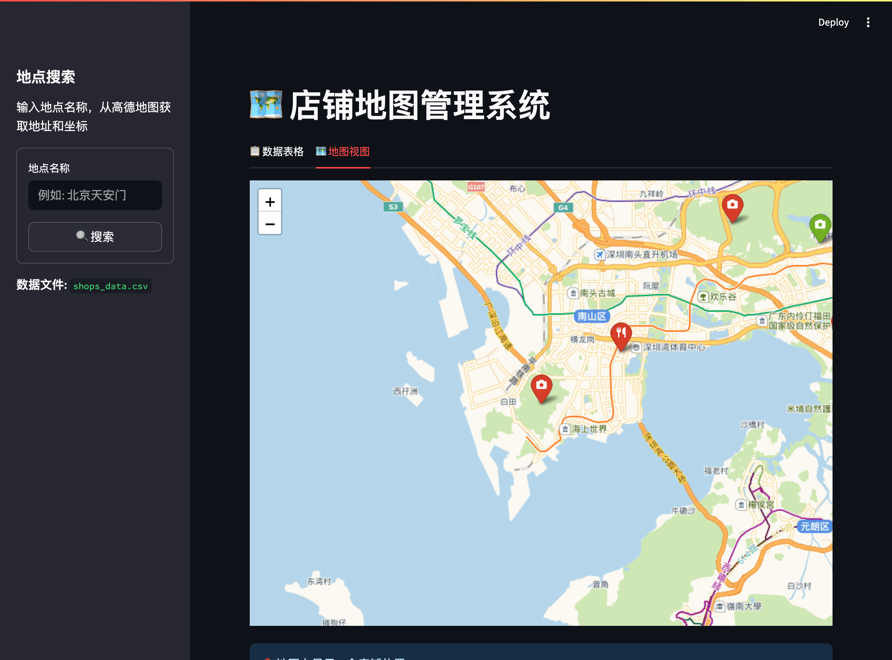
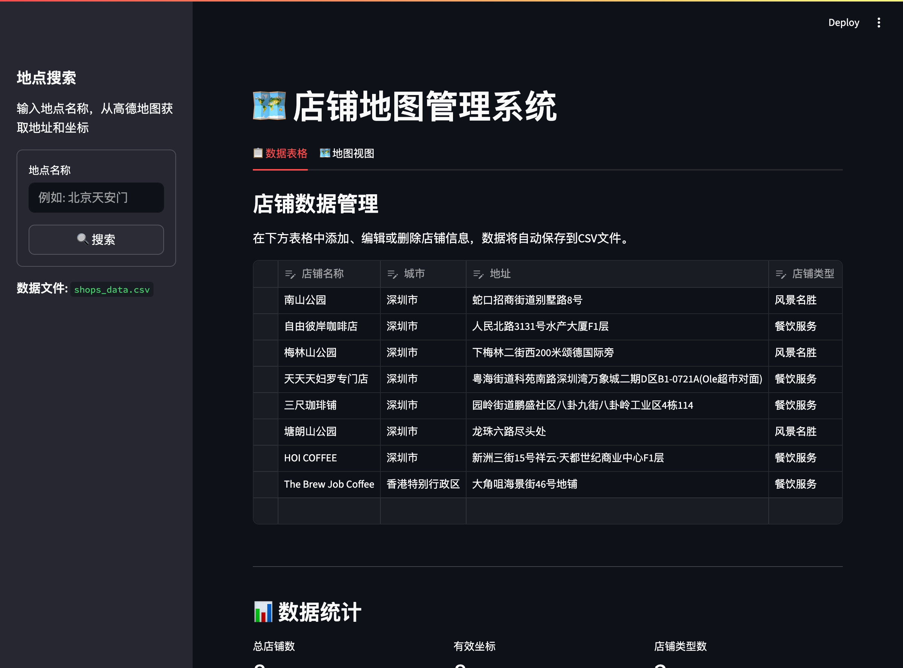

[English](README.md) | [中文](_README_CN.md)

# 店铺地图管理系统

基于 Streamlit 和 Folium 构建的地图店铺管理应用，允许用户在 CSV（本地）或 Supabase（云端）中管理店铺数据，并在高德地图图块上可视化展示。


# 在线体验：

https://chinamap.streamlit.app/


## 功能特点

- **用户认证**：注册并登录以将数据同步到云端
  - 本地模式：无需账户即可使用，数据存储在本地 CSV 文件中
  - 云端模式：登录后通过 Supabase 在设备间同步数据
- **店铺搜索与添加**：集成高德地图 API，通过名称或关键词搜索店铺，自动添加到个人列表
- **交互式地图可视化**：
  - 在交互式地图上显示所有已保存的店铺位置
  - 带有类别特定图标的自定义标记
  - 基于访问状态的颜色编码标记（"已访问"为红色，"想去"为绿色）
- **数据管理**：
  - 可编辑的表格视图，用于管理店铺信息
  - 自动保存到 CSV（本地）或 Supabase（云端）
  - 跟踪访问状态、评分和个人备注
- **图片上传**：上传和管理店铺照片（仅限云端模式）
  - 每个店铺可上传多张图片
  - 在店铺详情面板中查看图片
  - 从云端存储删除图片
- **分类管理**：按店铺类型组织（餐饮、零售、服务、娱乐、教育、医疗、风景名胜等）
- **访问跟踪**：区分已访问和想去的店铺
- **个人备注与评分**：记录已访问地点的体验、备注和星级评分（1-5星）

## 技术栈

- **前端框架**：Streamlit
- **地图组件**：Folium with streamlit-folium
- **数据处理**：Pandas
- **后端服务**：Supabase（认证与数据库）
- **文件存储**：Supabase Storage（图片托管）
- **地图 API**：高德地图 API

## 安装

1. 克隆此仓库：
```bash
git clone <repository-url>
cd map_app
```

2. 安装依赖：
```bash
pip install -r requirements.txt
```

3. 配置环境变量：
在项目根目录下创建 `.env` 文件，并添加您的 API 密钥：
```
GAODE_API_KEY=your_gaode_api_key_here
SUPABASE_URL=https://your-project.supabase.co
SUPABASE_KEY=your_supabase_anon_key_here
```

获取 API 密钥：
- **高德 API 密钥**：访问 https://console.amap.com/dev/key/app
- **Supabase**：访问 https://supabase.com 注册并创建新项目

**注意**：要使用云端功能（认证、数据同步、图片上传），您需要设置 Supabase：
- 启用邮箱/密码认证
- 创建名为 `user_shops` 的数据表
- 创建名为 `shopphoto` 的存储桶用于图片

参考 `.env.example` 文件查看所需的环境变量格式。

## 使用方法

1. 运行应用：
```bash
streamlit run app.py
```

2. 应用将在浏览器中打开，地址为 `http://localhost:8501`

3. **本地模式与云端模式**：
   - **本地模式**：无需登录即可开始使用 - 数据保存到 `shops_data.csv`
   - **云端模式**：注册/登录以在设备间同步数据并启用图片上传功能

4. **添加店铺**：
   - 使用侧边栏搜索框按名称搜索店铺
   - 点击搜索结果中的"添加到列表"按钮

5. **管理数据**：
   - 切换到"数据表格"标签页
   - 编辑店铺详情、访问状态、评分和备注
   - 更改会自动保存到 CSV（本地）或 Supabase（云端）

6. **管理图片**（云端模式）：
   - 点击地图上的任意店铺标记
   - 在店铺详情面板中上传图片
   - 查看或删除现有图片

7. **地图查看**：
   - 切换到"地图视图"标签页
   - 点击标记查看店铺详情和管理图片

## 数据存储

应用支持两种存储模式：

### 本地模式（无需登录）
- 店铺数据存储在 `shops_data.csv` 文件中
- 不支持图片功能

### 云端模式（使用 Supabase 账户）
- 店铺数据同步到 Supabase 数据库（`user_shops` 表）
- 图片存储在 Supabase Storage（`shopphoto` 存储桶）
- 数据在设备间持久保存

### 数据结构

| 列名 | 描述 |
|------|------|
| user_id | 用户 ID（仅云端模式） |
| shop_name | 店铺名称 |
| city | 城市名称 |
| address | 完整地址 |
| latitude | 纬度坐标 |
| longitude | 经度坐标 |
| shop_type | 店铺类别 |
| type | 旅程类型（咖啡、景点、美食、酒吧、其他） |
| visit_status | 访问状态（"想去"或"已访问"） |
| notes | 个人备注 |
| rating | 星级评分（0-5） |
| image_url | 图片 URL（JSON 数组，仅云端模式） |

## 项目结构

```
map_app/
├── app.py              # 主应用程序
├── map_utils.py        # 高德 API 和 Supabase 集成
├── requirements.txt    # Python 依赖
├── .env.example        # 环境变量模板
├── .gitignore          # Git 忽略规则
├── shops_data.csv      # 本地数据存储（自动创建）
├── static/
│   ├── style.css       # 自定义样式
│   └── screenshots/    # 应用截图
├── images/             # 图片资源
├── README.md           # 英文文档
└── _README_CN.md       # 中文文档（本文件）
```

## 界面截图




## 依赖项

- streamlit - Web 应用框架
- folium - 地图可视化
- streamlit-folium - Streamlit-Folium 集成
- pandas - 数据处理
- python-dotenv - 环境变量管理
- requests - API 调用 HTTP 客户端
- supabase - Supabase 客户端，用于认证和数据库

## 开源协议

本项目采用 MIT 协议开源。
